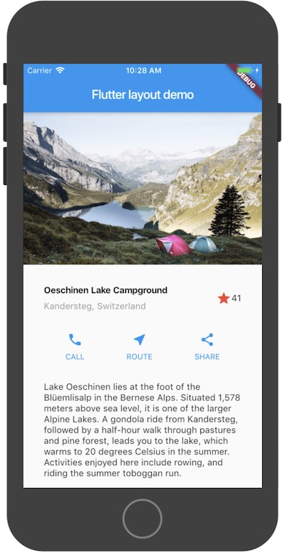
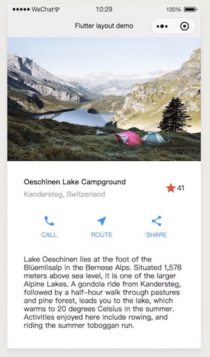

# flutter_mp

**flutter_mp** inspired by [alita](https://github.com/areslabs/alita)。 `Alita`引擎对`JSX`的动态处理方式，给声明式UI框架在
类小程序运行提供了思路。**flutter_mp**正是这个思路在**Flutter**上的尝试。 

**flutter_mp**的目标是把**Flutter**扩展到类小程序平台，**Flutter**是一个非常优秀的跨端框架，不仅可以运行在`Android`， `iOS`，通过[flutter_web](https://github.com/flutter/flutter_web)还
可以运行在`web`平台，但是官方并没有涉及小程序平台，希望**flutter_mp**可以填补这方面的空白。

现阶段，**flutter_mp**还是一个很不成熟的项目，还处于"实验阶段"，完成度还很低，很多东西还在探索阶段，离实际的可用还有很长的距离，我们也仅仅是把官方简单demo
运行在了微信小程序。另外，把所有的**Flutter**特性都在小程序上实现我们认为是不可能的，肯定会存在一些阉割和取舍，包括动画，手势等等在内的还原程度，我们也还在思考，欢迎
关注我们最新的进展。

如果你现在就有APP端，小程序端的跨端需求，我们还是建议你使用[Alita](https://github.com/areslabs/alita)。

<table>
   <tr>
   	    <td>Flutter</td>
   	    <td>微信小程序</td>
   </tr>
	<tr>
		<td></td>
		<td></td>
	</tr>
</table>

## TODO
暂时，我们还只支持`Center`，`Column`，`Container` ，`Expanded`，`Image.asset`，`ListView`，`Row`，`Text`这些基本Widget，暂不支持
自定义Widget，即使这些基本Widget也不是完全体，比如`ListView`。而且你的`Flutter`代码只能够出现在`lib/main.dart`文件中。 我们将大致按照如下的
顺序一步步完善`flutter_mp`。

1. 寻求**Flutter**布局在css下的等效表达
2. 完善基本 Widget
3. 支持 stateful Widget
4. 支持自定义Widget
5. 事件/生命周期
6. 多页面，导航/路由的支持
7. Flutter动画在小程序的部分实现（能还原的程度？？）
6. 小程序性能优化
7. 小程序包体积优化
8. 其他

## Getting started
现阶段，我们建议你仅仅在`Examples`下的[lakes](https://github.com/areslabs/areslabs/tree/master/examples/lakes)下修改代码，尝试**flutter_mp**。


1. 安装`flutter_mp_cli`
    ```shell
       pub global activate --source git https://github.com/areslabs/flutter_mp.git
    ```

2. 运行`pub global run flutter_mp -v` 查看命令是否安装成功
    
     **建议**：手动把Pub缓存的bin目录添加到PATH中： `PATH="$PATH":"$HOME/.pub-cache/bin"`。 这样你就可以直接在命令行运行`flutter_mp`。 否则你需要
   `pub global run flutter_mp`。 关于`pub global`请[查看](https://dart.dev/tools/pub/cmd/pub-global)。
   
   
3. 在你的`flutter`项目添加如下依赖
   ```yaml
      dev_dependencies:
        flutter_mp:
           git:
             url: https://github.com/areslabs/flutter_mp
             path: packages/flutter_mp
   ```
   
4. 执行命令 `pub global run flutter_mp -i [flutter目录] -o [目标小程序目录]` 

5. 使用微信开发者导入打开 `4`过程的 `[目标小程序目录]` 。这样你的flutter应用就运行在了微信小程序上

## Examples
1. 官方布局样例[lakes](https://github.com/areslabs/flutter_mp/tree/master/examples/lakes), 对应编译出来的小程序在[lakesMP](https://github.com/areslabs/flutter_mp/tree/master/examples/lakes)(当然你可以手动编译到任何你喜欢到目录)。

## 更新日志
本项目遵从 [Angular Style Commit Message Conventions](https://gist.github.com/stephenparish/9941e89d80e2bc58a153)，更新日志由 `conventional-changelog` 自动生成。完整日志请点击 [CHANGELOG.md](./CHANGELOG.md)。

## License
MIT License

Copyright (c) ARES Labs
